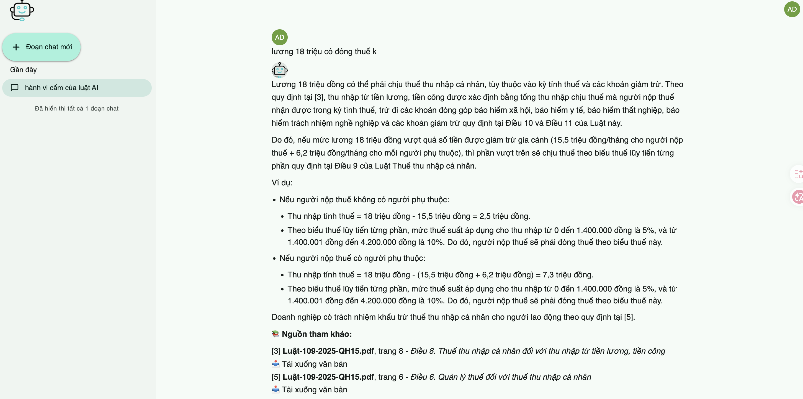
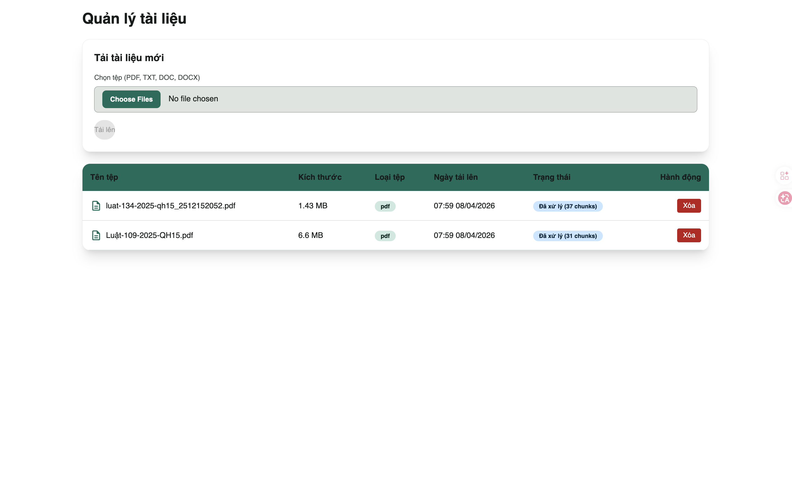
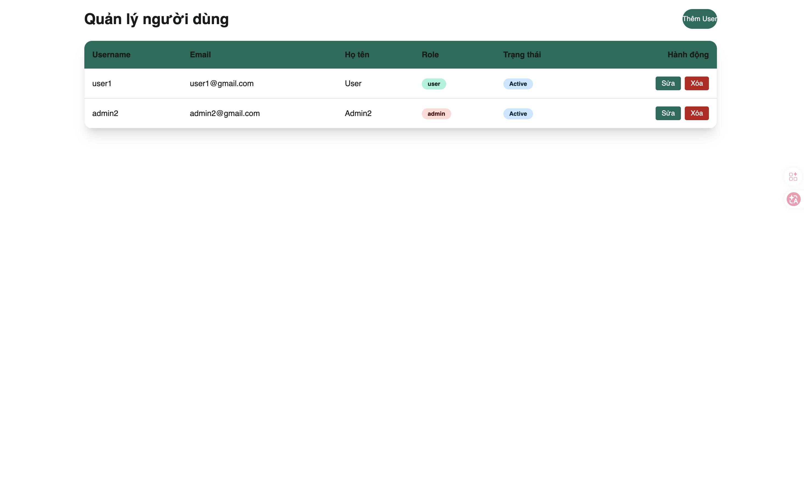

<div align="center">

# RAG Document Chatbot


[](https://python.org)
[](https://react.dev)
[](https://tailwindcss.com)
[](https://fastapi.tiangolo.com)
[](https://docker.com)


**Admins upload documents. Users ask questions. Get answers with citations.**


Performed hybrid search combining semantic and keyword-based retrieval (BM25) on Milvus with re-ranking to retrieve relevant context, then generated responses using a local LLM via Ollama, while processing multi-format documents—including scanned files via OCR—using Docling.


[Features](#features) · [Quick Start](#quick-start) · [Tech Stack](#tech-stack)


</div>


## Showcase

<div align="left">

**Chatbot**


**Document Management**


**User Management**

</div>


## Features

- AI-powered chatbot for document-based question answering  
- Answers with clear source citations  
-  Accurate information retrieval for complex queries  
- Supports multiple document formats, including scanned files  
- Conversation history management  
- Secure user authentication  
- Fast and scalable performance  
- Modern, responsive user interface 


## Quick Start

### Docker (Full Stack)

```bash
git clone https://github.com/thanhngocht/RAG-based-Document-Assistant
cd RAG-based-Document-Assistant
cp .env.example .env
# Edit .env 
docker compose up -d
```

First build takes ~5-10 minutes (downloads ML models ~2.5GB). Open http://localhost:5174
  

# Tech Stack

<details>
<summary><b>Backend</b></summary>

| Technology | Purpose |
|---|---|
| **FastAPI** | Async web framework with SSE streaming |
| **Mongodb** |  NoSQL database for storing application data|
| **Milvus** | Vector store — cosine similarity |
| **Docling** | Document parsing — PDF, DOCX, PPTX, HTML with structural extraction (switchable via config) |
| **sentence-transformers** | BAAI/bge-m3 embeddings + BAAI/bge-reranker-v2-m3 reranking |
| **ollama** | Local LLM — tool calling via prompt tags, multimodal support |

</details>

<details>
<summary><b>Frontend</b></summary>

| Technology | Purpose |
|---|---|
| **React 19*** | UI framework with strict typing |
| **Vite 7** | Dev server and production bundler |
| **TailwindCSS 4** | Utility-first styling with dark / light theme |
| **Framer Motion 12** | Layout animations, transitions, staggered entrances |
| **Lucide React** | Icon library |

<details>
<details>
<summary><b>Infrastructure</b></summary>

| Technology | Purpose |
|---|---|
| **MongoDB** | Document metadata, chat history, users |
| **Milvus** | Vector embeddings (HTTP client, containerized) |
| **Docker Compose** | Full-stack deployment (4 containers) |
| **nginx** | Production frontend serving + API/SSE reverse proxy |

</details>